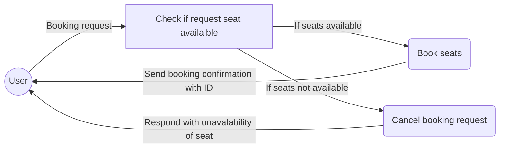

# Book This Show (API Sets)

## Installation
### Pre-Requisites
BookThisShow requires [Python 3]([https://www.python.org/](https://www.python.org/))  to run
- Python 3.6 or greater

### Steps
#### For Ubuntu Linux >= 16
> Install the dependencies and devDependencies
```sh
$ sudo apt install python3-pip git
$ pip install virtualenv
$ cd ~; mkdir bookthisshow; cd bookthisshow
$ virtualenv -p python3 bts_env
$ source bts_env/bin/activate
$ git clone https://github.com/ansm/bts.git
$ cd bts
$ pip install -r requirement.txt
```
> Start server (port 8000)
```sh
$ python manage.py migrate
$ python manage.py runserver 0.0.0.0:8000
> Nagivate 
```

## Process flow diagram [APIs]
###  Book the show (/api/show/book)


