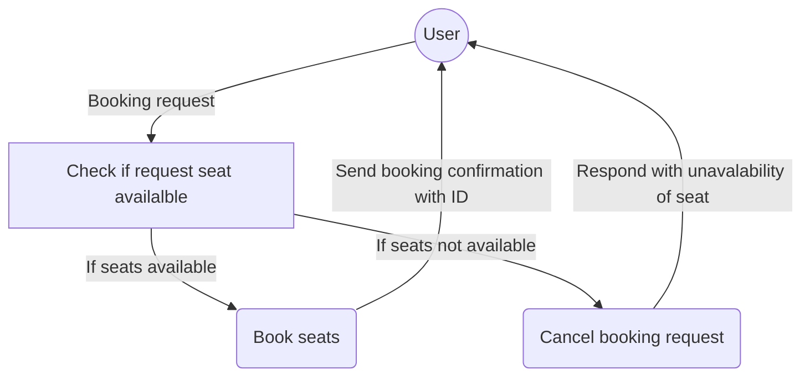

# Book This Show (API Sets)

## API Documentation
Complete API Documentation available [here](https://documenter.getpostman.com/view/3060921/TVCmQjK6#1267b83a-9f33-4a01-a600-e03caa4504c)
## Installation
### Pre-Requisites
BookThisShow requires [Python3](https://www.python.org/)  to run
- Python 3.6 or greater

### Steps
#### For Ubuntu Linux >= 16
> Install the dependencies and devDependencies
```sh
$ sudo apt install python3-pip git
$ pip3 install virtualenv
$ cd ~; mkdir bookthisshow; cd bookthisshow
$ virtualenv -p python3 bts_env
$ source bts_env/bin/activate
$ git clone https://github.com/ansm/bts.git
$ cd bts
$ pip3 install -r requirement.txt
```
> Migrate database & Start server (port 8000)
```sh
$ python manage.py migrate
$ python manage.py cities_light
$ python manage.py createsuperuser
$ python manage.py test
$ python manage.py runserver 0.0.0.0:8000
```
## Tech Stack 
### Libraries
 - [Django](https://www.djangoproject.com/)
	 - As a development framework
 -  [django-rest-auth](https://django-rest-auth.readthedocs.io/en/latest)
	 - For user management (Signup/ Login / Forgot Password etc.)
 - [django-rest-framework](https://www.django-rest-framework.org/)
	 - For developing REST APIs
### Database  
- [SQLite](https://www.sqlite.org/index.html) (A light weight DB) 
	- To store data generated on BTS
### WSGI HTTP Server
- [Gunicorn](https://gunicorn.org/) (A Python WSGI HTTP Server for UNIX)
### Web Server
- [Nginx](https://www.nginx.com/) (High performance LB & Web Serer/Reverse proxy server)

## Stack Architecture /Process Flow


## Flow charts  [APIs]
#### Book the show (/api/show/book)


